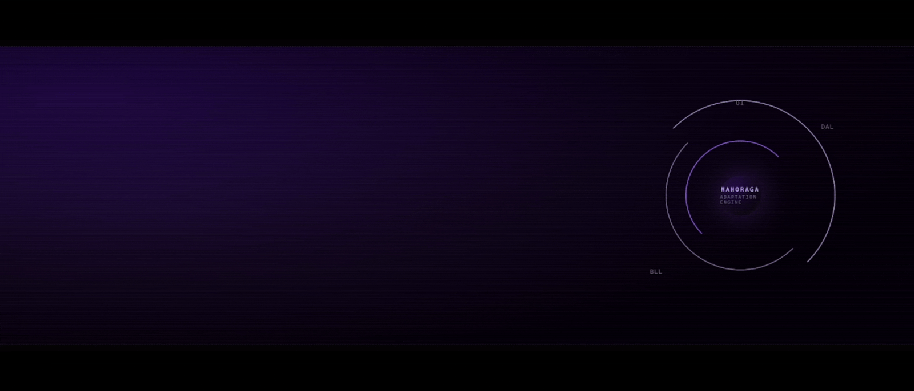

<div align="center">

# `Meriouma // Abdelhak`

### C# & SQL Server Developer · Desktop Applications · C++ Programmer

`Behind every interface, there's a system. I build both.`

<br>



<br>

> **Compiling ideas into reality...**
> **Building systems beneath the surface...**
> **Adapting to every system.**

</div>

---

## `01 // SYSTEM.IDENTITY`

```text
┌──────────────────────────────────────────────────────────────┐
│                    MERIOUMA // ABDELHAK                       │
├──────────────────────────────────────────────────────────────┤
│  ROLE        C# & SQL Server Developer                        │
│  FOCUS       Desktop Applications                             │
│  LANGUAGES   C# · C++                                         │
│  DATABASE    SQL Server                                       │
│  ARCHITECT   UI → BLL → DAL                                   │
│  STATUS      ● ONLINE          MODE: ADAPTIVE                 │
└──────────────────────────────────────────────────────────────┘
```

I build **desktop applications where interface, logic, and data work as one system.**

**Understand the problem → design the system → build the logic → protect the data → refine the interface.**

---

## `02 // ADAPTATION.PROTOCOL`

<div align="center">

**Different interfaces. Different architectures. Different databases.**
**One mindset: adapt, understand, solve.**

`MAHORAGA // ADAPTATION ENGINE`

`[ CODE ]` → `[ LOGIC ]` → `[ DATABASE ]` → `[ SYSTEM ]`

</div>

---

## `03 // TECHNICAL.ARSENAL`

<div align="center">

**Languages**


**Application Development**


**Database**


**Engineering**


</div>

---

## `04 // ARCHITECTURE`

```text
                         ┌────────────────────┐
                         │        USER        │
                         └─────────┬──────────┘
                                   │
                                   ▼
                    ┌──────────────────────────┐
                    │           UI             │
                    │        WinForms          │
                    └────────────┬─────────────┘
                                 │
                                 ▼
                    ┌──────────────────────────┐
                    │          BLL             │
                    │   Business Logic Layer   │
                    └────────────┬─────────────┘
                                 │
                                 ▼
                    ┌──────────────────────────┐
                    │          DAL             │
                    │   Data Access Layer      │
                    └────────────┬─────────────┘
                                 │
                                 ▼
                    ┌──────────────────────────┐
                    │       SQL SERVER         │
                    │     Database Engine      │
                    └──────────────────────────┘

                       
```

**Architecture is not decoration. It is how complexity stays under control.**

---

## `05 // PROJECTS`

<div align="center">

| Project | Technology | Type |
|---|---|---|
| **Drive License Management System** | C# · WinForms · SQL Server | Business Application |
| **Bank Management System** | C++ | Management System |
| **Pizza Tavola — UI Template** | C# · WinForms | UI / Desktop |
| **Halloween Tic-Tac-Toe** | C# · WinForms | Game |

[](https://github.com/7akomer/Drive_License_Management_System)
[](https://github.com/7akomer/Bank-Management-System)
[](https://github.com/7akomer/Pizza-UI-Project)
[](https://github.com/7akomer/XO_Game_Halloween)

</div>

---

## `06 // CERTIFICATIONS`

<div align="center">

```text
╔══════════════════════════════════════════════════════════╗
║                  CERTIFICATION.LOG                        ║
╠══════════════════════════════════════════════════════════╣
║  > C# Level 1                                              ║
║  > OOP As It Should Be In C#                               ║
║  > Algorithms & Problem Solving — Level 5                 ║
║  > Database Level 1 — SQL                                  ║
║  > Database — SQL Projects & Practice                      ║
╚══════════════════════════════════════════════════════════╝
```

</div>

---

## `07 // GITHUB.METRICS`

<div align="center">


<br><br>


</div>

---

## `08 // CONNECTION`

<div align="center">

### `BUILD SOMETHING WORTH DEBUGGING.`

[](https://t.me/hakomeriouma)
[](https://www.upwork.com/freelancers/~014427a9cd7c4bb486?mp_source=share)
[](mailto:x3propoco2021@gmail.com)

</div>

---

<div align="center">

```text
╭──────────────────────────────────────────────────────────╮
│   BEAUTY IN THE INTERFACE                                 │
│   // STRENGTH IN THE LOGIC                                │
│   // MADNESS IN THE DATABASE                               │
╰──────────────────────────────────────────────────────────╯
```

**Adapting to systems. Building better ones.**

☕ **Grab a coffee. Enjoy the profile.**

</div>
